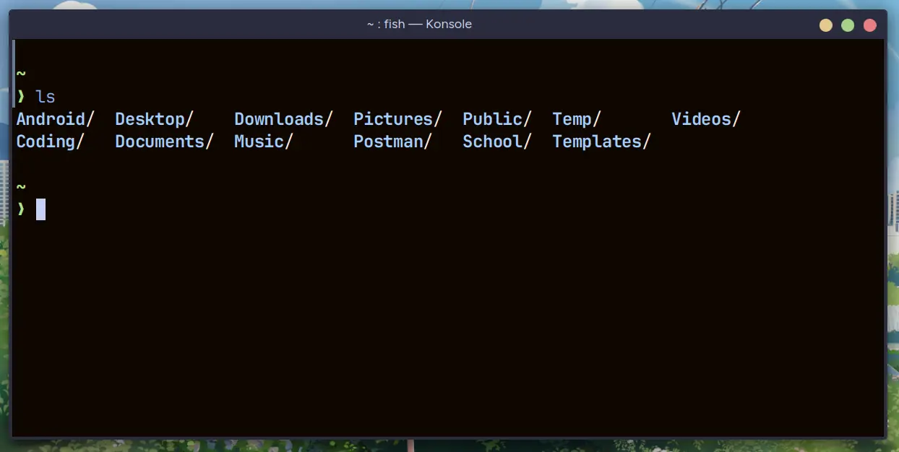
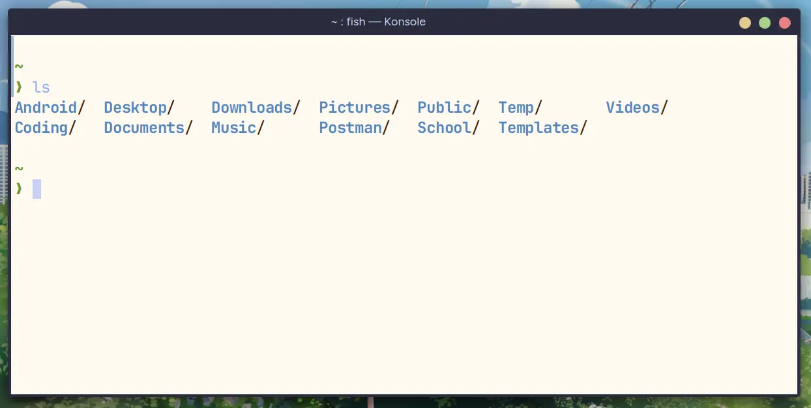

<div align="center">


### Whiskers for [Konsole](https://konsole.kde.org/)

<div>
    
    
</div>
</div>

## 👷‍♂️ Install

To install the theme download the color scheme file and copy it to konsole directory

🐈‍⬛ Panther

```bash
mkdir -p ~/.local/share/konsole
cd ~/.local/share/konsole
curl -o Whiskers-Panther.colorscheme https://raw.githubusercontent.com/Whiskers-Color-Scheme/konsole/main/src/panther.colorscheme
```

🐯 Tiger

```bash
mkdir -p ~/.local/share/konsole
cd ~/.local/share/konsole
curl -o Whiskers-Tiger.colorscheme https://raw.githubusercontent.com/Whiskers-Color-Scheme/konsole/main/src/tiger.colorscheme
```

## 💻 Maintainers

- [lighttigerxiv](https://github.com/lighttigerXIV)
